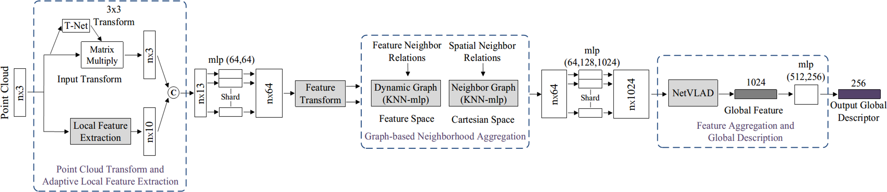

# LPD-Net: 3D Point Cloud Learning for Large-Scale Place Recognition and Environment Analysis

**[LPD-Net: 3D Point Cloud Learning for Large-Scale Place Recognition and Environment Analysis](http://openaccess.thecvf.com/content_ICCV_2019/papers/Liu_LPD-Net_3D_Point_Cloud_Learning_for_Large-Scale_Place_Recognition_and_ICCV_2019_paper.pdf)** ICCV 2019, Seoul, Korea

<b>Zhe Liu<sup>1</sup>, Shunbo Zhou<sup>1</sup>, Chuanzhe Suo<sup>1</sup></b>, Peng Yin<sup>3</sup>, Wen Chen<sup>1</sup>, Hesheng Wang<sup>2</sup>,Haoang Li<sup>1</sup>, Yun-Hui Liu<sup>1</sup>

<sup>1</sup>The Chinese University of Hong Kong,  <sup>2</sup>Shanghai Jiao Tong University, <sup>3</sup>Carnegie Mellon University




## Introduction
Point cloud based Place Recognition is still an open issue due to the difficulty in extracting local features from the raw 3D point cloud and generating the global descriptor,and it’s even harder in the large-scale dynamic environments. We develop a novel deep neural network, named <u><b>LPD-Net (Large-scale Place Description Network)</b></u>, which can extract discriminative and generalizable
global descriptors from the raw 3D point cloud. The arXiv version of LPD-Net can be found [here](https://arxiv.org/abs/1812.07050).
```
@InProceedings{Liu_2019_ICCV,
author = {Liu, Zhe and Zhou, Shunbo and Suo, Chuanzhe and Yin, Peng and Chen, Wen and Wang, Hesheng and Li, Haoang and Liu, Yun-Hui},
title = {LPD-Net: 3D Point Cloud Learning for Large-Scale Place Recognition and Environment Analysis},
booktitle = {The IEEE International Conference on Computer Vision (ICCV)},
month = {October},
year = {2019}
}
```
## Benchmark Datasets
The benchmark datasets introdruced in this work can be downloaded [here](https://drive.google.com/open?id=1H9Ep76l8KkUpwILY-13owsEMbVCYTmyx), which created by PointNetVLAD for point cloud based retrieval for place recognition from the open-source [Oxford RobotCar](https://robotcar-dataset.robots.ox.ac.uk/). Details can be found in [PointNetVLAD](https://arxiv.org/abs/1804.03492). 
* All submaps are in binary file format
* Ground truth GPS coordinate of the submaps are found in the corresponding csv files for each run
* Filename of the submaps are their timestamps which is consistent with the timestamps in the csv files
* Use CSV files to define positive and negative point clouds
* All submaps are preprocessed with the road removed and downsampled to 4096 points

### Oxford Dataset
* 45 sets in total of full and partial runs
* Used both full and partial runs for training but only used full runs for testing/inference
* Training submaps are found in the folder "pointcloud_20m_10overlap/" and its corresponding csv file is "pointcloud_locations_20m_10overlap.csv"
* Training submaps are not mutually disjoint per run
* Each training submap ~20m of car trajectory and subsequent submaps are ~10m apart
* Test/Inference submaps found in the folder "pointcloud_20m/" and its corresponding csv file is "pointcloud_locations_20m.csv"
* Test/Inference submaps are mutually disjoint


## Project Code

### Pre-requisites
* Python
* CUDA
* Tensorflow 
* Scipy
* Pandas
* Sklearn

Code was tested using Python 3 on Tensorflow 1.4.0 with CUDA 8.0 and Tensorflow 1.12.0 with CUDA 9.0

```
sudo apt-get install python3-pip python3-dev python-virtualenv
virtualenv --system-site-packages -p python3 ~/tensorflow
source ~/tensorflow/bin/activate
easy_install -U pip
pip3 install --upgrade tensorflow-gpu==1.4.0
pip install scipy, pandas, sklearn
pip install glog
```
### Dataset set-up
Download the zip file of the benchmark datasets found [here](https://drive.google.com/open?id=1H9Ep76l8KkUpwILY-13owsEMbVCYTmyx). Extract the folder on the same directory as the project code. Thus, on that directory you must have two folders: 1) benchmark_datasets/ and 2) LPD_net/

### Data pre-processing
We preprocess the benchmark datasets at first and store the features of point clouds on bin files to save the training time. The files only need to be generated once and used as input of networks. The generation of these files may take a few hours.
```
# For pre-processing dataset to generate pointcloud with features
python prepare_data.py

# Parse Arguments: --k_start 20 --k_end 100 --k_step 10 --bin_core_num 10
# KNN Neighbor size from 20 to 100 with interval 10, parallel process pool core numbers:10
```

### Generate pickle files
We store the positive and negative point clouds to each anchor on pickle files that are used in our training and evaluation codes. The files only need to be generated once. The generation of these files may take a few minutes.

```
cd generating_queries/ 

# For training tuples in LPD-Net
python generate_training_tuples_baseline.py

# For network evaluation
python generate_test_sets.py

# For network inference
python generate_inference_sets.py 
# Need to modify the variables (folders or index_list) to specify the folder
```

### Model Training and Evaluation
To train our network, run the following command:
```
python train_lpdnet.py
# Parse Arguments: --model lpd_FNSF --log_dir log/ --restore

# For example, Train lpd_FNSF network from scratch
python train_lpdnet.py --model lpd_FNSF

# Retrain lpd_FNSF network with pretrained model
python train_lpdnet.py --log_dir log/<model_folder,eg.lpd_FNSF-18-11-16-12-03> --restore
```
To evaluate the model, run the following command:
```
python evaluate.py --log_dir log/<model_folder,eg.lpd_FNSF-18-11-16-12-03>
# The resulst.txt will be saved in results/<model_folder>
```
To infer the model, run the following command to get global descriptors:
```
python inference.py --log_dir log/<model_folder,eg.lpd_FNSF-18-11-16-12-03>
# The inference_vectors.bin will be saved in LPD_net folder
```

## Pre-trained Models
The pre-trained models for lpd_FNSF networks can be downloaded [here](https://drive.google.com/open?id=1H9Ep76l8KkUpwILY-13owsEMbVCYTmyx). Put it under the ```/log```folder

## License
This repository is released under MIT License (see LICENSE file for details).
